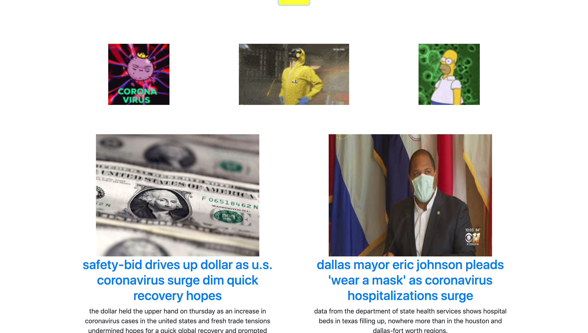

### Links:
Demo - [https://loganveik.github.io/topicsearch/](https://loganveik.github.io/topicsearch/)
Repo - [https://github.com/loganveik/topicsearch](https://github.com/loganveik/topicsearch)

### Description:
This is a basic topic search app which takes the user input and runs it through 2 api's simultaneously. The 2 api's are Youtube and GNews. Once searched, youll be displayed with 4 interactive youtube video cards, and 4 related news articles with links to the original article. If the images dont display, try clicking the search button again.

### Technologies Used:
HTML5, Bootstrap4, CSS3, Javascript, jQuery, Ajax, Gnews API, Youtube API.

### How to Use:
1) Enter virtually any topic into the serchbar.

2) Once searched, user is diplayed with 4 relevant news articles with clickable links. As well as 3 fun gifs directly related to topic.
